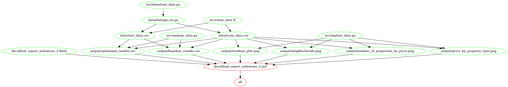

# AirBnB: How to price my new Vancouver AirBnB? 
#### DSCI 522 Group 3
#### By: Monique Wong, Polina Romanchenko, Trevor Kwan

## About

In this project, we build a predictive model to help new AirBnB hosts set the nightly price of their Vancouver AirBnB. Our predictive model predicts the market price of an AirBnb given the property, host and booking characteristics which we believe is given the the optimal price for both the host and AirBnB guests. 

At this stage, we have trained a variety of machine learning models based on property-, host- and book-related characteristics of existing Vancouver AirBnBs. Examples of characteristics include property type, neighborhood, the number of people who can be accommodated, the ability to instant book the property, the booking's cancellation policy and the responsiveness of the host. 

Surprisingly, our linear regression predictor exceeded the performance of more complex machine learning models that were evaluated (e.g., random forest regressor). This model, however, tends to consistently overestimate the price of AirBnB's below \$200/night and underestimate the price of AirBnB's above \$300/night. Further work should involve feature engineering to model interactions between features (e.g., neighborhood and property type) as well as fitting more complex linear models (e.g., that better model pricing behaviour above $300/night). 

Details about our dataset can be found [here](#dataset-source).

## Report
The final report can be found [here](https://github.com/UBC-MDS/DSCI_522_Group_303/blob/master/docs/final_report_milestone_2.md).

## Usage
There are two ways to reproduce this project. 

**Option 1: Requires Docker**
- Fork and clone this repo to your local machine
- Use the command line to navigate to the root of this project on your computer
- Input the following in your terminal (fill in PATH_ON_YOUR_COMPUTER with the absolute path to the root of this project)

`docker run --rm -v PATH_ON_YOUR_COMPUTER:/home/airbnb_price moniquewong/airbnbprice:v2.0 make -C '/home/airbnb_price' all`

- Use the following command to clean up the analysis:

`docker run --rm -v PATH_ON_YOUR_COMPUTER:/home/airbnb_price moniquewong/airbnbprice:v2.0 make -C '/home/airbnb_price' clean`

**Option 2: Install the dependencies on your own**
- Fork and clone this repo to your local machine
- Install the [dependencies](#dependencies) listed below
- To run the analysis, navigate to the root of this project and run the following on your Terminal:
`make all`
- To clean all generated analysis run:
`make clean`

## Dependencies
  - Python 3.7.4 and Python packages:
      - docopt==0.6.2
      - requests==2.22.0
      - pandas==0.25.2
      - numpy==1.17.2
      - altair==4.0.1
      - selenium==3.141.0
      - sklearn==0.22.1
      - scipy==1.3.1
  - R version 3.6.1 and R packages:
      - knitr==1.27
      - tidyverse==1.2.1
      - docopt==0.6.1
      - testthat==2.2.1
      - checkmate==1.9.4
      - kableExtra==1.1.0
      - here==0.1
  - GNU make 4.2.1

## Dependency Diagram of the Makefile

## Dataset Source
We have chosen a dataset that outlines Vancouver AirBnB listings. The dataset can be found [here](http://insideairbnb.com/get-the-data.html) under the Vancouver, British Columbia section. A direct link to download the dataset is [here](http://data.insideairbnb.com/canada/bc/vancouver/2019-11-09/data/listings.csv.gz). Data was compiled November 9 2019. 
