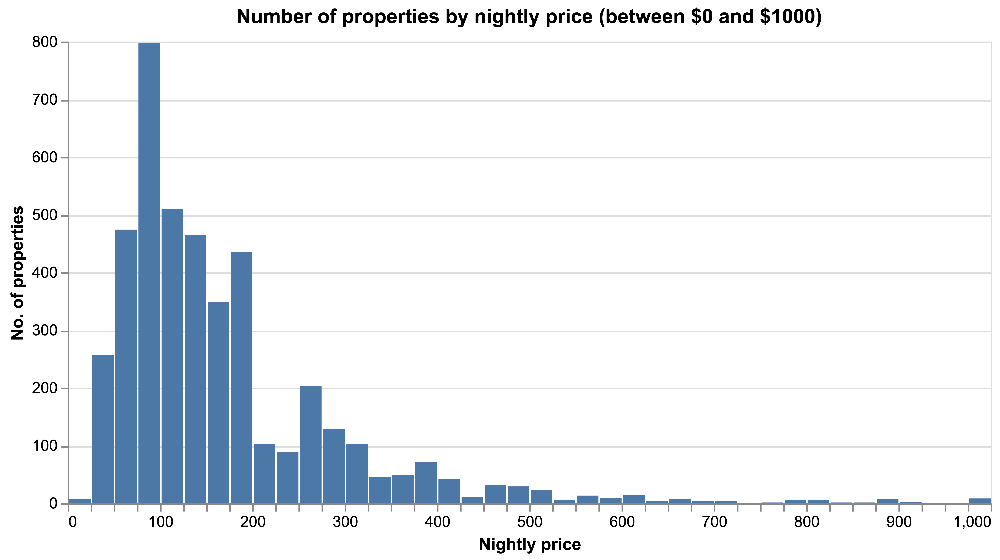
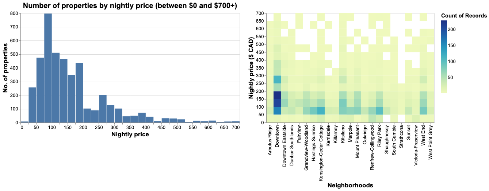
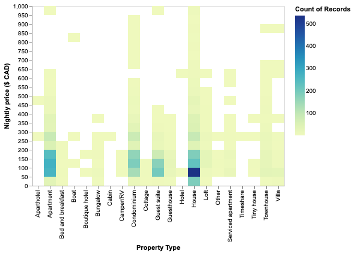
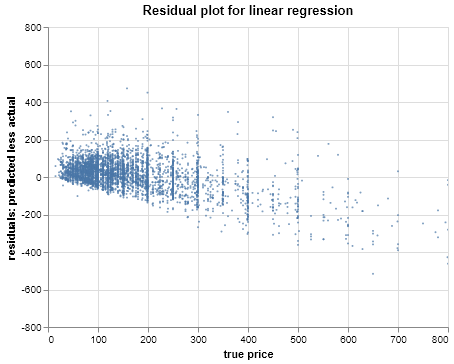

```{r setup, include=FALSE}
knitr::opts_chunk$set(echo = FALSE)
knitr::opts_knit$set(root.dir = here::here())
library(tidyverse)
library(knitr)
```

## Introduction

Our research question is: "At what nightly price should we list our Vancouver AirBnB?" 

This research question is predictive. Given the dataset, we want to build a machine learning model that can predict an appropriate nightly price for a new AirBnB property. An appropriate price would be one that is competitive compared to existing listings given the property, host and booking specific characteristics. 

Examples of these characteristics are below:

Property-related characteristics: property type, the neighborhood, number of people who can be accommodated, number of bathrooms, bedrooms and beds.

Host-related characteristics: host response rate to requests, whether the host is a superhost, whether the host identity has been verified.

Booking-related characteristics: whether the property can be instantly booked, the cancellation policy
To answer this overarching question, we would need to understand the following:

Which features from the raw dataset would be most predictive of nightly price?
Which machine learning model at which hyperparameter settings can best predict nightly price?
Under what range of parameter values (e.g., charactistics of properties) would our model perform reliably?

## Dataset and Source

We have chosen a dataset that outlines Vancouver AirBnB listings. The dataset can be found [here](http://insideairbnb.com/get-the-data.html) under the Vancouver, British Columbia section. A direct link to download the dataset is [here](http://data.insideairbnb.com/canada/bc/vancouver/2019-11-09/data/listings.csv.gz). Data were compiled November 9 2019.

## Analysis

Our research question requires us to build a model that predicts a continuous variable (price) based on property-, host- and booking-related characteristics which a combination of categorical and continuous variables. Types of models that would be appropriate for this task include KNN regressor, SVM regressor, linear regression, and random forest regressor.

Specifically, the steps we have to take are as follows:

1. **Understand and pre-process the data**: We want to understand our dataset better by understanding the composition of AirBnB listings in our dataset. We will have to identify strategies to address missing values as well as select and/or engineer features that would improve the robustness of the model we will develop. 

2. **Select and test baseline models**: We can begin by trying a wide range of machine learning models such as those mentioned above. We can shortlist those we will do hyperparameter optimization on based on computational time and preliminary scoring (e.g., MSE). We will select models that are quick to run and have high scores.

3. **Tune the hyperparameters for a subset of models**: We can optimize the hyperparameters for the shortlisted models from the previous step. We plan to optimize hyperparameters for the shortlisted models using RandomizedSearchCV, which implements a fit and score method and the parameters of the estimator are optimized by cross-validated search over parameter settings. Compared to GridSearchCV, RandomizedSearchCV does not try all out parameter values and selects only random combinations to train. We chose to implement RandomizedSearchCV because it allows for satisfactory hyperparameter selection while minmizing the runtime. After optimizing hyperparamters of these shortlisted models, we compared the optimized models with each other in terms of time and accuracy.

4. **Select model with the best performance**: The model we choose will be based on a combination of accuracy, computational intensiveness and interpretability. And finally, we will compute the residuals of the best performing model, showing the differences between the best model's price predictions and the actual price values. We will plot these residuals on the Y-axis and their corresponding prices on the X-axis, showing the model's accuracy at predicting at each given price in the range 0$ to 800$.

The R and Python programming languages [@R; @Python] and the following R and Python packages were used to perform the analysis: pandas [@mckinney2010data], numpy [@oliphant2006guide], requests [@chandra2015python], os [@Python], docopt [@docopt], tidyverse [@tidyverse], testthat [@testthat], checkmate [@checkmate], altair [@lyttle2018introducing], and sklearn [@scikit-learn].

## Results and Discussion

###### Exploratory Data Analysis

We first conducted exploratory data analysis to understand the relationships between airbnb price, number of properties listed with those prices, neighbourhood region of airbnb, and property type or airbnb. Shown below are several figures illustrating these associations.



Majority of properties were priced between $50 to $200 per night. There is a long right tail to this distribution indicating that there were few properties at high nightly prices. As we create a model that suggests / predicts a price of a new AirBnB property, we have to be conscious of the fact that the training set has had more data to learn from prices towards the centre of the distribution.

*Understanding Price by Neighborhood*



To understand the relationship between nightly price and neighborhoods, we analyze the distribution of the number of properties by neighborhood and price point. Some neighborhoods do not have any properties listed above a certain price point. For instance, Strathcona and Killarney have no properties listed above 350/night. Most neighborhoods do not have any properties listed above 600/night. This lack of training examples for properties of certain prices in certain neighborhoods has implications on our model's ability to predict properties in these "edge cases". Downtown and Kitsilano have some of the highest priced properties, with listings almost consistently up to 1000/night.
This analysis further emphasizes the need to combine neighborhoods to improve the performance of our model.

*Understanding Price by Property Type*


To understand the relationship between nightly price and property type, we analyze the distribution of the number of properties by property type and price point. Other than houses, condos and apartments, other categories have very sparse data, especially across price points. In particular, Aparthotel, Bed and breakfast, Boat, Boutique hotel, Cabin, Cottage, Hotel, Timeshare and Tinyhouse are problematic. These categories should probably be collapsed into "Other" as a part of preprocessing. The model would be able to best predict on unseen house, apartment and condo properties since there is the most data to learn from across price points.

###### Machine Learning Analysis
The tables below serve to answer the question: "Which machine learning model would best predict nightly price?"

```{r baseline table, echo = FALSE, message = FALSE, warning = FALSE}
baseline <- read_csv("output/baseline_results.csv")
kable(baseline, caption = "Table 1 shows the baseline training and validation mean squared errors and training and validation learning time.")
```

```{r optimized table, echo = FALSE, message = FALSE, warning = FALSE}
optimized <- read_csv("output/optimized_results.csv")

kable(optimized, caption = "Table 2 shows the optimized training and validation mean squared errors and training and validation learning time.")

```
Without hyperparamter optimization, we shortlisted the models: linear regression (lr), KNeighborsRegressor (kNN), and support vector regression (SVR), because they performed better in terms of accuracy and time. After hyperparameter optimization, we compared the optimized time and accuracy of SVR and kNN with linear regression, and decided that linear regression overall was the better machine learning model to predict price given our data performing well on the 3 categories: accuracy, time, and interpretability.



The above plot shows the residuals of the best model plotted against the true prices. The residuals indicate the difference in predicted value of the linear regression model and the actual price value. In this case, we can see how well our linear regression model predicted prices at any given price within the range of 0 to 800. 

To further improve our solution to the question "At what nightly price should we list our Vancouver AirBnB?", there are several remedies for future researchers whom choose to take on this project. First, we would suggest consulting domain experts in the field of Airbnb when deciding which features to select for model training usage. Our preliminary decision to select features was based solely off of our common collective knowledge of hostel prices. Second, we would suggest optimizing more hyperparamters within the parameter grid. This could allow for more accurate and time efficient models due to their optimized hyperparameters. And lastly, an ideal answer to our research question would include the ideal range of parameter values for each characteristic/feature in which our model performs reliably, but due to time constraints we were not able to obtain this.

# References

